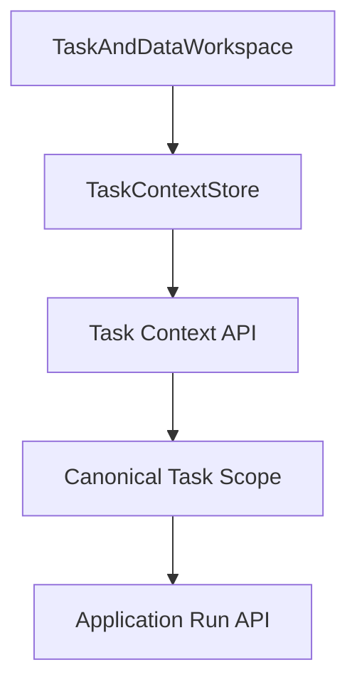
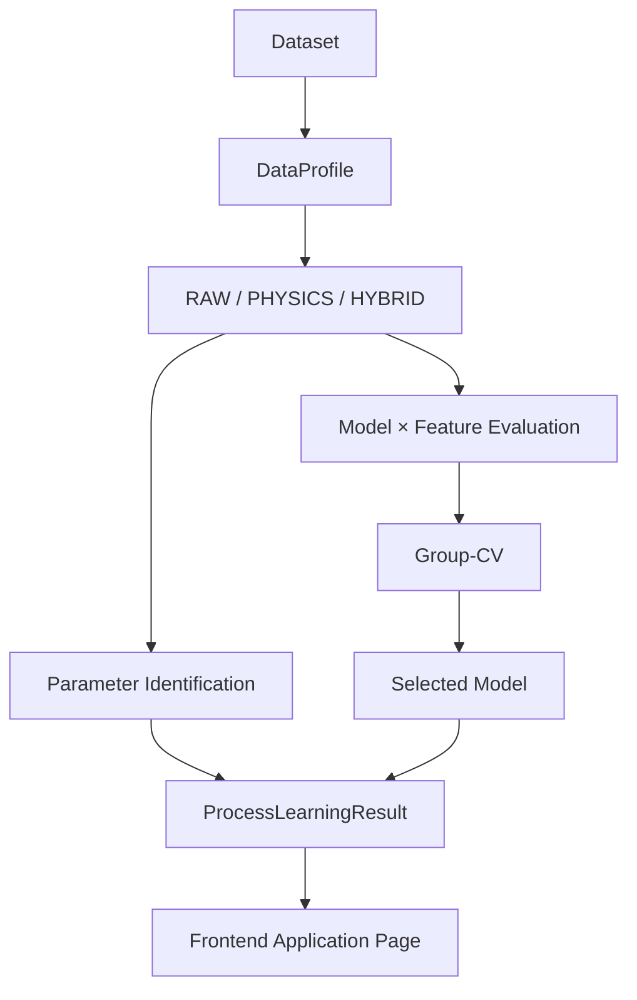
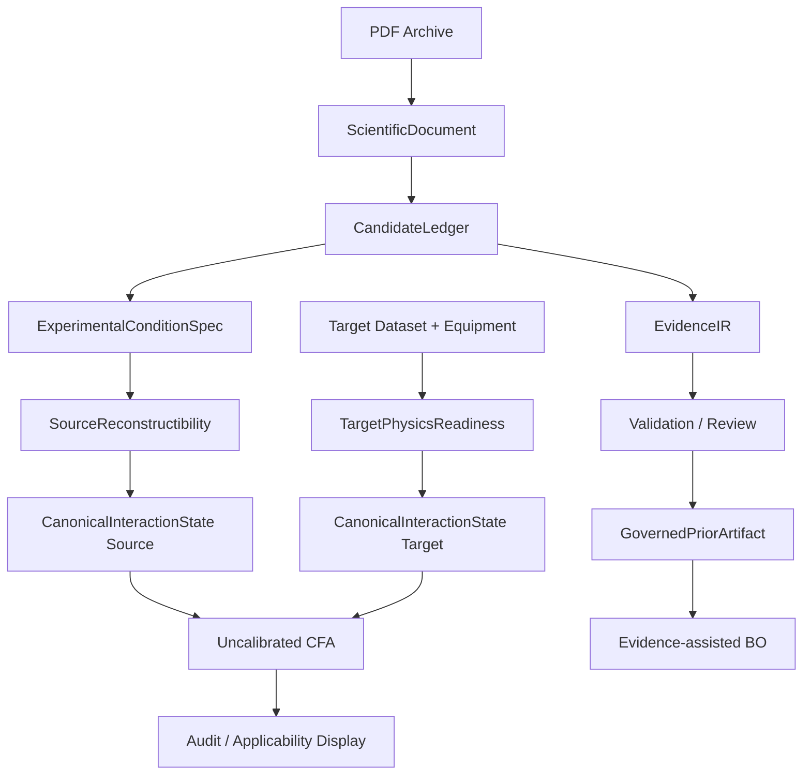
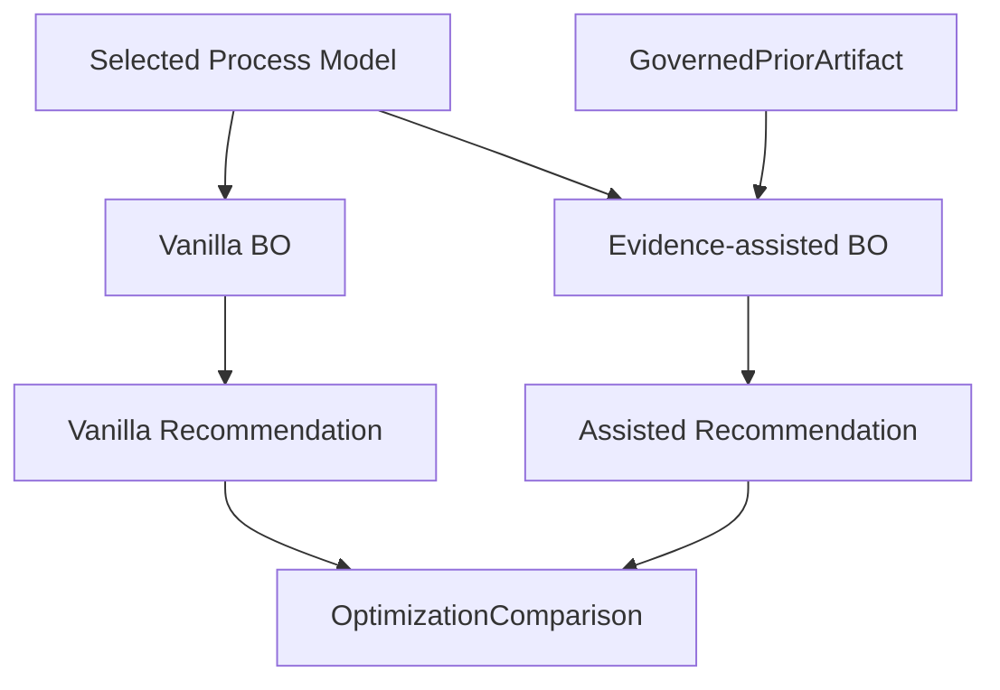

# Topic 2 前端重构开发任务说明

> 文档状态：DRAFT FOR IMPLEMENTATION  
> 基线仓库：`milumilelu/ultrafast-laser-process-learning`  
> 设计基线：`9e31a46` 及 `topic2-demo-v1` 已冻结能力  
> 目标版本建议：`topic2-frontend-v2` / `topic2-demo-v1.1-ui`  
> 核心定位：**Human–Agent Scientific Workbench for Ultrafast Laser Process Learning**

---

## 0. 文档目的

本文件用于指导 Topic 2 软件前端的下一阶段重构开发。重构目标不是重新设计科学算法，而是把当前已经完成的：

- 参数辨识；
- 工艺建模；
- 文献科学信息读取；
- Evidence / E2P；
- Source Reconstructibility；
- Target Physics Readiness；
- Physics Canonicalization；
- Uncalibrated CFA；
- Governed Prior；
- Vanilla BO / Evidence-assisted BO；
- Audit / Replay；
- Agent Streaming / Proposal / Scientific Analysis；

组织成一套面向最终应用场景的统一交互流程。

最终软件应让用户始终围绕三个核心应用问题工作：

1. **参数辨识：哪些工艺参数和物理特征最重要？**
2. **工艺建模：哪个模型最可靠地描述当前加工过程？**
3. **工艺优化：基于当前数据和科学知识，下一轮实验最值得做什么？**

其中 Physics、Literature、Evidence、E2P、CFA、Agent 不作为彼此割裂的“功能页面”，而作为支撑这三个最终应用结果的科学基础设施。

---

# 1. 重构目标

## 1.1 产品目标

将当前“功能模块式后台”重构为：

> **围绕实验决策组织的 Human–Agent Scientific Workbench。**

用户不再需要理解内部模块调用顺序，例如：

```text
Task
→ Identification
→ Model Policy
→ Training
→ RAG
→ Evidence
→ CFA
→ BO
```

而应按研究问题自然推进：

```text
定义任务与数据
        ↓
理解已有实验数据
        ↓
理解相关科学文献
        ↓
判断证据与目标任务的适用性
        ↓
参数辨识
        ↓
工艺建模
        ↓
工艺优化
        ↓
形成下一轮实验决策
        ↓
回溯全部数据、证据、模型与算法
```

---

## 1.2 工程目标

前端重构必须满足：

- 不复制科学真值；
- 不改变 M6–M9 / E2P / BO 已冻结科学语义；
- 不在浏览器内重新实现 Physics / CFA / Prior / BO；
- Agent 不直接修改正式科学状态；
- 所有正式执行结果来自后端；
- 所有用户可见结果都能追溯到 `Task Context / Run / Evidence / Artifact`；
- Demo 模式与 Research 模式共用同一套结果组件；
- 新 UI 不要求一次性重写所有旧页面；
- 允许阶段性迁移和旧路由兼容。

---

# 2. 核心设计原则

## UI-P1：最终应用结果优先

前端一级应用结果固定为：

```text
参数辨识
工艺建模
工艺优化
```

后端仍可保持统一 `Process Learning + E2P + CFA + BO` 架构。

---

## UI-P2：科学基础设施与应用结果分层

```text
支撑层：
Task / Dataset / Equipment
Literature / Candidate / Evidence
Physics / Reconstructibility / CFA
Governance / Agent

                    ↓

应用层：
参数辨识 → 工艺建模 → 工艺优化
```

---

## UI-P3：Unknown ≠ Mismatch 必须在视觉层面成立

统一状态颜色：

| 科学状态 | UI 语义 | 推荐颜色 |
|---|---|---|
| AVAILABLE / VERIFIED / KNOWN | 可用 / 已确认 | 绿色 |
| PARTIAL / UNVERIFIED | 部分 / 待确认 | 黄色 |
| UNKNOWN / NOT_REPORTED / BLOCKED | 未知 / 不可判断 | 灰色 |
| MISMATCH / ERROR / CONTRADICTED | 明确不匹配 / 错误 | 红色 |
| Evidence / Literature | 科学证据 | 紫色 |

禁止把 UNKNOWN 渲染为红色。

---

## UI-P4：Uncalibrated CFA 绝不表现为概率

允许：

```text
KNOWN
PARTIAL
UNKNOWN
MISMATCH
warnings
```

禁止：

```text
Applicability 82%
Transfer Probability 0.76
Confidence 90%
```

页面必须始终显示：

```text
UNCALIBRATED CFA
calibration_status = NOT_YET_CALIBRATED
```

---

## UI-P5：Agent 是解释与编排层，不是科学真值来源

Agent 可以：

- 解释结果；
- 发起 workflow；
- 建议修改；
- 生成 proposal；
- 展示工具调用；
- 展示引用。

Agent 不可：

- 直接修改 Task Context；
- 直接修改模型选择；
- 直接把 RAG 数值写入设备档案；
- 直接创建 BO prior；
- 绕过 `GovernedPriorArtifact`；
- 绕过 deterministic validator；
- 把未校准 CFA 变成权重。

---

## UI-P6：科学对象只保存引用，不在多个 store 复制内容

例如：

```text
workflowStore
    activeEvidenceId = "E-014"
```

而不是复制完整 Evidence 对象。

科学真值仍来自 backend / CandidateLedger / EvidenceIR / Run Artifact。

---

# 3. 新版信息架构

## 3.1 顶层导航

```text
项目
└── 项目概览

研究
├── 任务与数据
└── 科学知识

应用
└── 工艺智能应用

追溯
└── 运行与审计

资源
├── 实验数据
├── 文献库
└── 设备档案
```

---

## 3.2 路由规划

```text
/
    ProjectWorkspace

/task
    TaskAndDataWorkspace

/evidence
    ScientificEvidenceWorkspace

/application
    IntelligentProcessApplication

/application?tab=summary
/application?tab=identification
/application?tab=modeling
/application?tab=optimization

/runs
    AuditWorkspace

/demo
    Topic2DemoWorkspace

/resources/data
    DataResourcePage

/resources/literature
    LiteratureResourcePage

/resources/equipment
    EquipmentResourcePage
```

旧路由兼容：

```text
/identification → /application?tab=identification
/modeling       → /application?tab=modeling
/optimization   → /application?tab=optimization
/database       → /resources/data
```

---

# 4. 软件模式

顶部增加：

```text
[ 展示模式 ] [ 研究模式 ]
```

---

## 4.1 展示模式 Demo Mode

绑定冻结场景：

```text
Target material     SiC
Laser               fs
Process             rectangular_groove
Objective           depth_um
Dataset             fixed Topic2 fixture
Literature          fixed 5-paper pilot set
Equipment           EQ-DEMO-FS
BO seed             42
CFA                  uncalibrated
```

展示模式特征：

- Task 配置只读；
- 数据集固定；
- 文献固定；
- seed 固定；
- 一键运行；
- 不允许人工修改科学输入；
- 强调结果解释与追溯；
- 结果必须可重放。

入口：

```text
/demo
```

主按钮：

```text
运行 Topic 2 演示
```

---

## 4.2 研究模式 Research Mode

允许：

- 修改材料；
- 修改激光；
- 修改工艺任务；
- 修改设备；
- 修改目标；
- 修改搜索空间；
- 单独运行参数辨识；
- 单独训练模型；
- 人工覆盖模型；
- 运行新的 scientific analysis；
- Evidence 审核；
- 运行 Vanilla / Assisted BO；
- 创建新的 Run。

---

# 5. App Shell 重构

当前固定右侧 Agent 面板应改为可展开 Drawer。

建议布局：

```text
┌───────────────────────────────────────────────────────────────┐
│ Project / Task │ Demo/Research │ Release │ Backend │ Agent   │
├───────────────┬───────────────────────────────────────────────┤
│ Workflow Nav  │                                               │
│               │                Main Workspace                 │
│               │                                               │
│               │                                               │
│               │                                     [AI助手] │
├───────────────┴───────────────────────────────────────────────┤
│ Task / Data / Model / Evidence / CFA / BO 状态摘要            │
└───────────────────────────────────────────────────────────────┘
```

---

## 5.1 Header

显示：

```text
Project
Task Context ID : version
Demo / Research Mode
Release Version
Topic2 Backend Health
Agent Health
```

---

## 5.2 Global Context Bar

始终展示：

```text
SiC
fs
rectangular groove
depth_um ↑
EQ-DEMO-FS
18 samples
Selected Model: RSM
```

任何 Task Context 更新后自动刷新。

---

## 5.3 AI Assistant Drawer

右下按钮：

```text
AI 助手
```

展开后：

```text
[对话] [执行流] [引用与审计]
```

不再永久占据主工作区 380px。

---

# 6. 项目概览页面

## 6.1 页面目标

回答：

> 当前研究任务处于什么状态？下一步可以做什么？

---

## 6.2 Workflow Stepper

```text
任务定义
  ✓
  │
数据准备
  ✓ 18 samples
  │
过程学习
  ✓ RAW / RSM
  │
科学证据
  ✓ 5 papers
  │
CFA
  △ UNCALIBRATED
  │
优化
  ✓ Vanilla + Assisted
  │
实验决策
  →
```

---

## 6.3 Research Readiness Matrix

| 层 | 状态 | 摘要 |
|---|---|---|
| Target Data | READY | 18 samples |
| Process Learning | READY | RAW / RSM |
| Equipment | PARTIAL | spot unverified |
| Source Evidence | READY | 5 papers |
| Physics | PARTIAL | power missing |
| CFA | UNCALIBRATED | 5 facets |
| E2P Prior | GOVERNED | evidence IDs traceable |
| BO | READY | Vanilla / Assisted |

---

## 6.4 快捷入口

```text
继续研究
查看工艺智能应用
运行固定 Demo
查看最近 Run
```

---

# 7. 任务与数据页面

页面采用三阶段：

```text
Step 1 研究任务
Step 2 数据与设备
Step 3 Readiness Check
```

---

## 7.1 研究任务

字段：

```text
material_id
laser_type
process_type
geometry_type
objective_metric
process_params
```

正式修改必须：

```text
Task Context version += 1
```

Agent 只读当前正式版本。

---

## 7.2 数据与设备

展示：

```text
Dataset
Equipment Dataset ID
Equipment Profile ID
Sample Count
Unique Designs
Machine Bounds
Optical Properties
Material Properties
```

每个设备输入显示 provenance：

```text
spot_diameter_um
5 μm
source: equipment_profile
status: UNVERIFIED
```

---

## 7.3 Physics Readiness

使用矩阵：

| Coordinate | Status | Dependencies | Reason |
|---|---|---|---|
| pulse_interval | AVAILABLE | frequency | — |
| pulse_spacing | AVAILABLE | frequency + speed | — |
| pulse_overlap | UNVERIFIED | spot | spot unverified |
| peak_fluence | BLOCKED | power + spot | power missing |
| normalized_fluence | BLOCKED | Fth | Fth unavailable |

禁止前端自行判断 dependency。

所有状态来自：

```text
TargetPhysicsReadinessReport
CanonicalInteractionState
```

---

# 8. 科学知识页面

## 8.1 页面目标

回答：

> 系统使用了哪些文献？抽取了哪些科学信息？哪些能进入 E2P？为什么？

---

## 8.2 三栏结构

```text
┌───────────────┬──────────────────────────┬────────────────────────┐
│ Papers        │ Evidence Workspace       │ Applicability / CFA    │
│               │                          │                        │
│ Paper 04      │ Candidate                │ Material               │
│ Paper 10      │ Condition                │ Task                   │
│ Paper 11      │ Evidence                 │ InteractionState       │
│ Paper 13      │ Provenance               │ Reconstructibility     │
│ CFRP          │ Governance               │ Reachability           │
└───────────────┴──────────────────────────┴────────────────────────┘
```

---

## 8.3 Paper Card

```text
Paper 11
SiC · fs

Processing conditions      2
Measurement conditions     2
Scientific candidates     37
Mapped evidence             8
Reconstructibility     PARTIAL
```

---

## 8.4 Evidence Lifecycle

单条 evidence 显示：

```text
PDF
 ↓
ScientificDocument
 ↓
ScientificCandidate
 ↓
ExperimentalCondition
 ↓
EvidenceIR
 ↓
GovernedPriorArtifact
```

详情：

```text
Evidence ID
Parameter
Raw Value
Normalized Value
Unit
Source Paper
Page / Block
Quote
Condition ID
Condition Role
Verification
Mapping
Governance
Used by BO
```

---

# 9. CFA 展示设计

## 9.1 CFA Matrix

| Evidence | Material | Task | Interaction | Reconstructibility | Reachability |
|---|---|---|---|---|---|
| Paper 04 | KNOWN | PARTIAL | PARTIAL | PARTIAL | PARTIAL |
| Paper 10 | KNOWN | KNOWN | UNKNOWN | PARTIAL | PARTIAL |
| Paper 11 | KNOWN | PARTIAL | PARTIAL | PARTIAL | PARTIAL |
| CFRP | MISMATCH | MISMATCH | UNKNOWN | PARTIAL | PARTIAL |

---

## 9.2 CFA Cell Inspector

点击：

```text
Paper 11 / InteractionState / PARTIAL
```

展开：

| Coordinate | Source | Target | Comparison |
|---|---|---|---|
| pulse_interval | AVAILABLE | AVAILABLE | COMPARABLE |
| pulse_spacing | AVAILABLE | AVAILABLE | COMPARABLE |
| pulse_overlap | AVAILABLE | UNVERIFIED | UNVERIFIED |
| peak_fluence | DEPENDENCY_MISSING | BLOCKED | INCOMPARABLE |

显示 warnings。

---

## 9.3 CFA 科学状态固定栏

```text
Method: Uncalibrated CFA
Calibration: NOT_YET_CALIBRATED
Independent Validation: Partial / Research Prototype
```

Known limitations 可链接到 validation artifact。

---

# 10. 工艺智能应用页面

这是新版前端核心页面。

路由：

```text
/application
```

---

## 10.1 Tab

```text
[综合结果]
[参数辨识]
[工艺建模]
[工艺优化]
```

---

## 10.2 应用状态条

```text
[1 参数辨识 ✓] ─── [2 工艺建模 ✓] ─── [3 工艺优化 ✓]
```

---

# 11. 综合结果 Tab

用于：

- 答辩；
- 组会；
- Demo；
- 最终应用结果概览。

结构：

```text
Task
 ↓
Parameter Identification
 ↓
Process Modeling
 ↓
Process Optimization
```

---

## 11.1 参数辨识 Summary Card

显示：

```text
Selected Feature View
RAW

Top Parameters
1. scan_speed
2. frequency
3. pulse_width

Physics Coverage
2 AVAILABLE
3 BLOCKED / UNVERIFIED
```

按钮：

```text
查看完整辨识结果
```

---

## 11.2 工艺建模 Summary Card

显示：

```text
Selected Model
RSM

Group-CV
RMSE
MAE
Fold Count

Uncertainty
Native / Auxiliary
```

按钮：

```text
查看模型比较
```

---

## 11.3 工艺优化 Summary Card

显示：

```text
Recommended Next Experiment

pulse_width
frequency
hatch_spacing
passes
scan_speed

Predicted Outcome
Acquisition Score
```

并显示：

```text
E2P Prior: APPLIED
CFA: AUDIT ONLY
```

按钮：

```text
查看优化依据
```

---

# 12. 参数辨识 Tab

## 12.1 核心问题

> 哪些工艺参数和物理特征最重要？

---

## 12.2 Feature View

```text
RAW
PHYSICS
HYBRID
```

默认显示系统选择结果。

研究模式允许切换查看。

---

## 12.3 可控参数重要性

推荐水平 bar chart：

```text
scan speed        ███████████
frequency         █████████
pulse width       ██████
hatch spacing     ███
passes            ██
```

同时显示：

```text
importance
effect_direction
rank
```

---

## 12.4 机理特征

显示：

```text
pulse_interval
pulse_spacing
pulse_overlap
pulses_per_spot
...
```

与 controllable ranking 分区。

---

## 12.5 Physics Feature Matrix

直接复用 Target / Physics readiness 数据。

---

# 13. 工艺建模 Tab

## 13.1 核心问题

> 哪个模型最可靠地描述当前加工过程？

---

## 13.2 Model Decision Card

```text
Recommended Model
RSM

Reason
✓ lowest Group-CV RMSE
✓ stable across folds
△ no native uncertainty
```

---

## 13.3 Model Comparison Table

| Model | RMSE | MAE | R² | Uncertainty | Status |
|---|---:|---:|---:|---|---|
| RSM | ... | ... | ... | — | SELECTED |
| GPR | ... | ... | ... | YES | CANDIDATE |
| RF | ... | ... | ... | — | CANDIDATE |
| HistGB | ... | ... | ... | — | CANDIDATE |

---

## 13.4 人工覆盖

点击其他模型：

```text
Proposed Change

RSM → GPR

Reason:
需要 uncertainty-aware optimization

[Apply]
[Reject]
```

Apply 后：

- 更新 Task Context selected model；
- 生成审计记录；
- 不覆盖原系统推荐；
- `selection_mode = manual`。

---

# 14. 工艺优化 Tab

## 14.1 核心问题

> 基于当前数据与科学知识，下一轮实验最值得做什么？

---

## 14.2 Recommendation Card

主显示：

```text
Recommended Next Experiment

Pulse Width
Frequency
Hatch Spacing
Passes
Scan Speed

Predicted depth
Prediction interval
```

文案固定为：

```text
推荐下一实验点
```

禁止：

```text
最优工艺参数
```

---

## 14.3 Vanilla vs Evidence-assisted

两栏：

```text
Vanilla BO
vs
Evidence-assisted BO
```

字段：

```text
recommended_parameters
predictions
acquisition score
prior_guidance
search_prior_applied
```

---

## 14.4 Prior Influence

显示：

```text
Base UCB
Evidence Prior Term
Final Acquisition
```

如果推荐结果相同，也必须展示：

```text
vanilla_search_prior_applied = false
assisted_search_prior_applied = true
```

---

## 14.5 Governed Prior Trace

显示：

```text
GovernedPriorArtifact
content_hash
evidence_ids
approval_ids
verification
```

点击 evidence ID 跳转：

```text
/evidence?evidence=...
```

---

# 15. Scientific Basis 侧栏

工艺智能应用页面增加可折叠：

```text
Scientific Basis
```

显示摘要：

```text
Literature            5 papers
Evidence Claims       16 / 45
CFA                    UNCALIBRATED
Material               KNOWN
Task                   PARTIAL
Interaction            PARTIAL
Reconstructibility     PARTIAL
Reachability           PARTIAL
Governed Prior         VERIFIED
```

按钮：

```text
查看完整科学证据
```

---

# 16. 一键完整分析

应用页顶部：

```text
运行完整分析
```

仅作为 orchestration，不代表在浏览器实现算法。

Workflow：

```text
Task Validation
↓
Dataset Audit
↓
Process Learning
↓
Scientific Evidence
↓
Source Reconstructibility
↓
Target Readiness
↓
Canonicalization
↓
Uncalibrated CFA
↓
Governed Prior
↓
Vanilla BO
↓
Evidence-assisted BO
↓
Application Result
```

研究模式仍允许阶段级按钮：

```text
重新运行参数辨识
重新训练模型
重新运行优化
```

---

# 17. 前后端职责边界

## 17.1 前端负责

- Task Context 编辑；
- 状态展示；
- 用户操作；
- 页面编排；
- API 调用；
- WorkflowEvent 消费；
- Agent Streaming 展示；
- Artifact ID 导航；
- 人工 proposal Apply / Reject；
- 可视化；
- 前端缓存。

---

## 17.2 Topic2 Backend 负责

- 数据过滤；
- DataProfile；
- Process Learning；
- Group-CV；
- Model Selection；
- Model Training；
- BO；
- Run persistence；
- Audit；
- Artifact retrieval。

---

## 17.3 Scientific / Agent Backend 负责

- Scientific Analysis；
- Literature retrieval；
- structured ingestion orchestration；
- Candidate / Evidence；
- E2P；
- Equipment profile；
- Agent Session；
- NDJSON streaming；
- WorkflowEvent；
- Proposal generation。

---

## 17.4 Scientific Kernel 负责

以下绝不移到前端：

```text
ultrafast_physics
ultrafast_reconstructibility
ultrafast_interaction
ultrafast_cfa
ultrafast_e2p
ultrafast_bo
```

---

# 18. 现有前端 API 适配

当前可继续复用的客户端能力包括：

## topic2Api

```text
health()
materials()
experiments()
scopeCapability()
compileEvidence()
modelPolicy()
trainModels()
recommend()
listRuns()
```

## agentApi

```text
health()
createSession()
chat()
streamChat()
createAnalysisJob()
getAnalysisJob()
evidenceCandidates()
runIdentificationV2()
getEquipmentProfile()
profileMachineBounds()
machineBounds()
llmConfig()
```

第一阶段重构优先复用这些接口。

---

# 19. 建议新增后端聚合接口

为避免前端重新实现 `demo/t2_slice/pipeline.py` 编排逻辑，建议后端增加统一 Application Workflow API。

---

## 19.1 创建完整应用 Run

```http
POST /api/topic2/application-runs
```

Request：

```json
{
  "task_context_id": "T2-SIC-001",
  "task_context_version": 7,
  "mode": "research",
  "stages": [
    "identification",
    "modeling",
    "scientific_evidence",
    "cfa",
    "optimization"
  ],
  "optimization_modes": ["vanilla", "evidence_assisted"],
  "random_seed": 42
}
```

Response：

```json
{
  "run_id": "app-run-...",
  "status": "running",
  "workflow_version": "topic2-application-v1"
}
```

---

## 19.2 查询应用 Run

```http
GET /api/topic2/application-runs/{run_id}
```

Response：

```json
{
  "run_id": "...",
  "status": "completed",
  "task_context_ref": "...",
  "stages": {
    "identification": { "status": "completed", "artifact_id": "..." },
    "modeling": { "status": "completed", "artifact_id": "..." },
    "scientific_evidence": { "status": "completed", "artifact_id": "..." },
    "cfa": { "status": "completed", "artifact_id": "..." },
    "optimization": { "status": "completed", "artifact_id": "..." }
  },
  "result": {
    "summary_artifact_id": "..."
  }
}
```

---

## 19.3 获取综合结果

```http
GET /api/topic2/application-runs/{run_id}/result
```

推荐响应结构：

```json
{
  "target_task": {},
  "process_learning": {},
  "evidence_summary": {},
  "cfa_summary": {},
  "governed_prior": {},
  "optimization": {
    "vanilla": {},
    "evidence_assisted": {}
  },
  "audit": {}
}
```

可直接映射当前 vertical slice result。

---

# 20. 建议新增 Artifact API

所有详细科学对象通过 ID 获取：

```http
GET /api/artifacts/{artifact_id}
```

或按类型：

```http
GET /api/runs/{run_id}/process-learning
GET /api/runs/{run_id}/evidence
GET /api/runs/{run_id}/cfa
GET /api/runs/{run_id}/governed-prior
GET /api/runs/{run_id}/bo
```

前端不应从多个页面自行重新计算同一对象。

---

# 21. WorkflowEvent 统一执行流

当前 ScientificAnalysisProgress 为旧专用模型。

新版建议建立通用：

```ts
type WorkflowEventType =
  | 'RUN_STARTED'
  | 'RUN_COMPLETED'
  | 'STAGE_STARTED'
  | 'STAGE_PROGRESS'
  | 'STAGE_COMPLETED'
  | 'TOOL_STARTED'
  | 'TOOL_COMPLETED'
  | 'ENTITY_CREATED'
  | 'ARTIFACT_CREATED'
  | 'VALIDATION'
  | 'WARNING'
  | 'ERROR'
```

---

## 21.1 WorkflowEvent

```ts
interface WorkflowEvent {
  eventId: string
  runId: string
  sequence: number
  timestamp: string

  type: WorkflowEventType
  stage?: string
  summary: string

  progress?: {
    current?: number
    total?: number
  }

  entityRefs?: {
    type: string
    id: string
  }[]

  artifactRefs?: {
    type: string
    id: string
  }[]

  details?: Record<string, unknown>
}
```

---

## 21.2 不进入 Activity Timeline 的事件

以下 streaming transport event 只影响聊天 UI：

```text
delta
heartbeat
thinking_status
```

不得作为正式 scientific activity 保存。

---

# 22. Workflow Event 传输

推荐优先：

```text
NDJSON streaming
```

现有 Agent Streaming 已具备类似能力。

应用 Run 可增加：

```http
GET /api/topic2/application-runs/{run_id}/events
Accept: application/x-ndjson
```

前端：

```text
fetch
→ ReadableStream
→ line parser
→ WorkflowEvent
→ workflowStore
→ ActivityTimeline
```

流中断后：

```text
GET run state
→ resume from last sequence
```

禁止重新执行 workflow。

---

# 23. 幂等性

所有可能触发正式科学执行的请求必须带：

```text
client_request_id
```

或：

```text
idempotency_key
```

例如：

```json
{
  "client_request_id": "uuid"
}
```

同一请求重试：

```text
返回原 run_id
```

禁止重复执行 BO / Evidence / Scientific Analysis。

---

# 24. 前端 Store 设计

保留：

```text
taskContextStore
scienceStore
agentStore
pageContextStore
```

新增：

```text
workflowStore
applicationStore
```

---

## 24.1 workflowStore

只保存执行状态：

```ts
interface WorkflowState {
  activeRunId: string | null
  status: 'idle' | 'running' | 'completed' | 'failed'
  currentStage: string | null
  events: WorkflowEvent[]
  lastSequence: number
}
```

---

## 24.2 applicationStore

保存 Application Result references：

```ts
interface ApplicationState {
  activeApplicationRunId: string | null

  processLearningArtifactId: string | null
  evidenceArtifactId: string | null
  cfaArtifactId: string | null
  governedPriorArtifactId: string | null
  vanillaBoRunId: string | null
  assistedBoRunId: string | null

  selectedTab:
    | 'summary'
    | 'identification'
    | 'modeling'
    | 'optimization'
}
```

不保存完整 CandidateLedger / CFA Reports 副本。

---

# 25. 端到端数据流

## 25.1 Task → Application



---

## 25.2 Process Learning



---

## 25.3 Literature / E2P / CFA



注意：

```text
CFA 当前只做 audit/assessment
不修改 prior weight
```

---

## 25.4 Optimization



---

# 26. Application Result 数据契约

建议新增前端统一类型：

```ts
interface Topic2ApplicationResult {
  runId: string
  workflowVersion: string

  targetTask: TargetTaskSummary

  processLearning: {
    selectedFeatureView: 'RAW' | 'PHYSICS' | 'HYBRID'
    selectedModel: string
    controllableRanking: ParameterImportance[]
    mechanismRanking: ParameterImportance[]
    modelComparison: ModelMetric[]
    physicsReadiness: PhysicsCoordinateStatus[]
  }

  scientificBasis: {
    paperCount: number
    candidateCount?: number
    evidenceCount: number
    governedEvidenceCount: number
  }

  cfa: {
    version: string
    calibrationStatus: 'NOT_YET_CALIBRATED'
    facetSummary: Record<string, FacetStatus>
    warnings: string[]
  }

  optimization: {
    vanilla: BOResult
    evidenceAssisted: BOResult
    priorAppliedEvidence: PriorAppliedEvidence
  }

  audit: {
    evidenceIds: string[]
    priorContentHash: string
    boRunIds: string[]
    modelVersion?: string
    replayable: boolean
  }
}
```

---

# 27. Agent Drawer

## 27.1 对话 Tab

显示：

```text
User Message
Assistant Message
References
Proposal
```

快捷动作根据 application tab 动态生成。

---

## 27.2 执行流 Tab

使用 `WorkflowEvent`。

例如：

```text
09:42:01 Application run started
09:42:02 Dataset loaded
09:42:04 Process learning started
09:42:08 Model selected: RSM
09:42:10 Scientific evidence started
09:42:15 5 papers processed
09:42:18 CFA assessment completed
09:42:19 Governed prior compiled
09:42:21 Vanilla BO completed
09:42:22 Evidence-assisted BO completed
09:42:23 Recommendation ready
```

---

## 27.3 引用与审计 Tab

显示：

```text
Paper
Candidate
Evidence
Model
CFA Report
Governed Prior
BO Run
```

点击跳转对应页面。

---

# 28. Agent 快捷动作

## 参数辨识

```text
为什么 scan speed 排第一？
RAW 和 HYBRID 为什么不同？
当前缺少哪些物理输入？
```

## 工艺建模

```text
为什么选择 RSM？
GPR 与 RSM 的差异是什么？
如果人工选择 GPR 会怎样？
```

## 工艺优化

```text
为什么推荐这个实验点？
E2P 先验实际影响了什么？
Vanilla 与 Assisted 为什么相同/不同？
下一轮最值得验证什么？
```

---

# 29. 人工 Proposal

Agent 不能直接修改科学状态。

统一：

```text
Agent Proposal
     ↓
User Apply / Reject
     ↓
Backend Change
     ↓
Audit Event
```

例如：

```text
Model Selection Proposal

System:
RSM

Proposal:
GPR

Reason:
Need uncertainty-aware surrogate

[Apply]
[Reject]
```

---

# 30. Demo Workspace

`/demo` 不新造结果组件。

复用：

```text
IntelligentProcessApplication
```

但注入：

```text
mode = demo
readonly = true
scenario = DEMO_SCENARIO_01
```

---

## 30.1 Demo Narrative

```text
① Target
② Parameter Identification
③ Process Modeling
④ Scientific Evidence
⑤ CFA Applicability
⑥ E2P Governed Prior
⑦ Vanilla vs Assisted BO
⑧ Recommended Next Experiment
⑨ Audit / Replay
```

---

## 30.2 Demo 最终屏

标题：

```text
Why should I trust this recommendation?
```

内容：

```text
DATA
18 experimental samples

MODEL
Group-CV selected model

EVIDENCE
Governed literature claims

APPLICABILITY
Uncalibrated CFA
Unknown preserved

OPTIMIZATION
GP-UCB + audited soft prior

TRACEABILITY
Every result links to source artifacts
```

---

# 31. 运行与审计页面

## 31.1 Run List

```text
Run ID
Run Type
Task Context
Status
Created At
Release Version
```

---

## 31.2 Run Timeline

```text
Task Context
↓
Dataset
↓
Process Learning
↓
Evidence
↓
CFA
↓
Governed Prior
↓
Vanilla BO
↓
Assisted BO
↓
Recommendation
```

---

## 31.3 Artifact Panel

```text
Task Context
ProcessLearningResult
ScientificDocument
CandidateLedger
EvidenceIR
SourceReadiness
TargetReadiness
CanonicalState
CFAReport
GovernedPriorArtifact
BOAuditTrace
```

---

## 31.4 Replay

按钮：

```text
Replay
```

完成后：

```text
Scientific payload identical    ✓
Runtime IDs changed             expected
```

---

# 32. 错误 / 降级策略

## 32.1 Agent Offline

```text
Agent unavailable
```

不阻塞：

```text
Task
Identification
Modeling
Optimization
Audit
```

显示：

```text
已切换至标准科学计算模式
```

---

## 32.2 Scientific Analysis Offline

已有 Evidence 可继续消费。

没有 Evidence：

```text
Vanilla BO 可运行
Evidence-assisted BO unavailable
```

---

## 32.3 CFA 不完整

例如：

```text
Material KNOWN
Task PARTIAL
Interaction UNKNOWN
```

仍显示报告。

禁止阻塞整个应用。

---

## 32.4 Physics 缺失

只阻塞依赖坐标。

禁止：

```text
Physics incomplete → disable whole application
```

---

# 33. 前端组件目录建议

```text
src/
├── components/
│   ├── shell/
│   │   ├── AppShell.tsx
│   │   ├── WorkflowNav.tsx
│   │   ├── GlobalContextBar.tsx
│   │   └── ModeSwitcher.tsx
│   │
│   ├── workflow/
│   │   ├── WorkflowStepper.tsx
│   │   ├── ResearchReadiness.tsx
│   │   ├── StageGate.tsx
│   │   └── StageSummary.tsx
│   │
│   ├── learning/
│   │   ├── ParameterImportanceChart.tsx
│   │   ├── PhysicsReadinessMatrix.tsx
│   │   ├── FeatureViewSelector.tsx
│   │   ├── ModelDecisionCard.tsx
│   │   └── ModelComparisonTable.tsx
│   │
│   ├── evidence/
│   │   ├── PaperNavigator.tsx
│   │   ├── EvidenceLifecycle.tsx
│   │   ├── EvidenceInspector.tsx
│   │   ├── ProvenanceViewer.tsx
│   │   ├── CFAMatrix.tsx
│   │   └── CFAFacetInspector.tsx
│   │
│   ├── optimization/
│   │   ├── RecommendationCard.tsx
│   │   ├── OptimizationComparison.tsx
│   │   ├── PriorInfluencePanel.tsx
│   │   └── EvidenceTracePanel.tsx
│   │
│   └── assistant/
│       ├── AssistantDrawer.tsx
│       ├── ChatTab.tsx
│       ├── ActivityTimeline.tsx
│       └── AuditReferences.tsx
│
├── pages/
│   ├── ProjectWorkspace.tsx
│   ├── TaskAndDataWorkspace.tsx
│   ├── ScientificEvidenceWorkspace.tsx
│   ├── IntelligentProcessApplication.tsx
│   ├── AuditWorkspace.tsx
│   └── Topic2DemoWorkspace.tsx
│
├── stores/
│   ├── taskContext.ts
│   ├── science.ts
│   ├── agent.ts
│   ├── workflow.ts
│   └── application.ts
│
└── api/
    ├── topic2.ts
    ├── agent.ts
    ├── application.ts
    └── artifacts.ts
```

---

# 34. 分阶段开发任务

## Phase UI-0：Freeze Current UI Baseline

目标：

- 当前页面不删；
- screenshot / E2E baseline；
- route compatibility freeze；
- 数据契约记录。

产出：

```text
docs/frontend/FRONTEND_V2_BASELINE.md
```

---

## Phase UI-1：App Shell + Route Migration

任务：

- 新 `AppShell`；
- 新导航；
- `Demo / Research` switch；
- Agent → Drawer；
- 旧路由 redirect；
- Global Context Bar。

验收：

```text
UI1-G1 旧页面仍可访问
UI1-G2 Task Context 不丢失
UI1-G3 Agent streaming 行为不回退
UI1-G4 旧 /identification /modeling /optimization 自动跳新页
```

---

## Phase UI-2：Application Workspace Shell

实现：

```text
/application
```

Tab：

```text
summary
identification
modeling
optimization
```

第一阶段直接使用现有 stores 的数据。

验收：

```text
UI2-G1 三应用结果均可在一个页面访问
UI2-G2 切换 Tab 不重复触发科学计算
UI2-G3 Summary 由已有正式结果生成
```

---

## Phase UI-3：Parameter Identification Integration

迁移：

```text
IdentificationPage
→ IdentificationTab
```

保留：

- RAW / PHYSICS / HYBRID；
- controllable ranking；
- mechanism ranking；
- feature build；
- Physics unavailable。

新增：

- importance chart；
- Physics readiness matrix；
- selected view summary。

---

## Phase UI-4：Modeling Integration

迁移：

```text
ModelingPage
→ ModelingTab
```

保留：

- model policy；
- training；
- Group-CV；
- manual proposal。

新增：

- Model Decision Card；
- selection reason；
- model metric comparison visualization。

---

## Phase UI-5：Optimization Integration

迁移：

```text
OptimizationPage
→ OptimizationTab
```

重点修改：

当前 UI 的单路 Vanilla 行为升级为：

```text
Vanilla vs Evidence-assisted
```

必须消费后端真实：

```text
prior_applied_evidence
governed_prior
```

验收：

```text
UI5-G1 vanilla prior_applied=false
UI5-G2 assisted prior_applied=true
UI5-G3 governed prior hash 可点击追溯
UI5-G4 CFA 不改变 prior weight
```

---

## Phase UI-6：Scientific Evidence Workspace

实现：

- Paper Navigator；
- Candidate / Condition / Evidence；
- Provenance；
- CFA Matrix；
- CFA Inspector；
- Governed Prior Trace。

---

## Phase UI-7：WorkflowEvent + Activity

实现：

- workflowStore；
- Application Run events；
- ActivityTimeline；
- ScientificAnalysisProgress adapter；
- streaming resume；
- idempotency。

---

## Phase UI-8：One-click Application Workflow

新增：

```text
Run Full Analysis
```

前端只发起 workflow。

后端负责 stage orchestration。

---

## Phase UI-9：Demo Workspace

绑定：

```text
DEMO_SCENARIO_01
```

只读。

复用 Application Workspace。

---

## Phase UI-10：Audit / Replay

实现：

- Run timeline；
- Artifact navigator；
- replay；
- payload comparison。

---

# 35. 后端开发任务

## BE-1 Application Orchestrator

把当前 vertical slice 编排能力封装为正式 service：

```text
Topic2ApplicationService
```

输入：

```text
TaskState
DataState
KnowledgeState
ModelState
```

输出：

```text
Topic2ApplicationResult
```

---

## BE-2 Application Run Persistence

持久化：

```text
application_run_id
task_context_ref
workflow_version
stage_status
artifact_refs
created_at
completed_at
```

---

## BE-3 Workflow Event Bus

统一：

```text
Application
Scientific Analysis
Agent Tool Calls
```

但只记录正式 workflow event。

---

## BE-4 Artifact Query API

允许 UI 按 ID 获取：

```text
EvidenceIR
CFAReport
GovernedPriorArtifact
BOAuditTrace
```

---

## BE-5 Vanilla / Assisted Comparison Endpoint

保证返回：

```text
vanilla
evidence_assisted
prior_applied_evidence
```

前端不自行拼接。

---

# 36. 前后端对接顺序

建议：

```text
第一阶段：
旧 API → 新 UI

第二阶段：
新增 Application API → 替代多接口 UI orchestration

第三阶段：
WorkflowEvent → 替代页面 polling / stage-specific progress

第四阶段：
Artifact API → 完整 trace navigation
```

不要第一天就要求后端重写所有接口。

---

# 37. API Compatibility Layer

新前端可建立：

```ts
ApplicationGateway
```

接口：

```ts
interface ApplicationGateway {
  runIdentification(...)
  runModeling(...)
  runOptimization(...)
  runFullApplication(...)
  getApplicationResult(...)
}
```

第一阶段：

```text
调用 topic2Api + agentApi
```

第二阶段：

```text
内部切换到 applicationApi
```

页面组件不感知迁移。

---

# 38. 测试策略

## 38.1 Unit

必须测试：

- status color；
- Unknown != Mismatch；
- CFA probability 字段不存在；
- summary aggregation；
- workflow event reducer；
- route redirects；
- proposal state。

---

## 38.2 Component

测试：

```text
ParameterImportanceChart
PhysicsReadinessMatrix
ModelDecisionCard
CFAMatrix
OptimizationComparison
ActivityTimeline
```

---

## 38.3 Integration

Mock backend contract：

```text
Task
→ ProcessLearningResult
→ CFA
→ GovernedPrior
→ BO
```

---

## 38.4 E2E Demo

固定 Demo Scenario：

```text
打开 /demo
→ Run Demo
→ Process Learning complete
→ Evidence complete
→ CFA visible
→ Vanilla visible
→ Assisted visible
→ prior_applied true
→ recommendation visible
→ audit trace clickable
```

---

# 39. Release Gate

## RF-UI1

```text
npm build PASS
typecheck PASS
vitest PASS
```

## RF-UI2

```text
旧路由全部兼容
```

## RF-UI3

```text
Task Context version 全局一致
```

## RF-UI4

```text
参数辨识 / 建模 / 优化均在 Application 页面
```

## RF-UI5

```text
Unknown 从不渲染成 Mismatch
```

## RF-UI6

```text
CFA 无 probability/confidence UI
```

## RF-UI7

```text
Vanilla / Assisted 对照来自真实后端
```

## RF-UI8

```text
prior_applied_evidence 可见
```

## RF-UI9

```text
Evidence ID → Provenance 可追溯
```

## RF-UI10

```text
Agent offline 不阻塞科学主链
```

## RF-UI11

```text
Demo Scenario 固定且可重放
```

## RF-UI12

```text
Replay scientific payload 一致
```

---

# 40. 本阶段明确不做

```text
× calibrated CFA UI
× transfer probability
× Dynamic Trust UI
× 自动 evidence weighting
× Agent 自动批准 Evidence
× 自动修改设备档案
× 自动 schema mutation
× 大规模 dashboard 装饰性图表
× 为了前端方便复制 scientific algorithms
```

---

# 41. 优先级

## P0

```text
App Shell
Application Workspace
参数辨识迁移
工艺建模迁移
工艺优化 Vanilla/Assisted 对照
Demo Workspace
```

## P1

```text
Scientific Evidence Workspace
CFA Matrix
WorkflowEvent
Audit / Replay
```

## P2

```text
Resource UX
高级 Artifact Inspector
跨 Run Comparison
```

---

# 42. 推荐开发里程碑

```text
F0 Frontend V2 Architecture Freeze
↓
F1 App Shell
↓
F2 Intelligent Process Application
↓
F3 Vanilla / Assisted Optimization Integration
↓
F4 Scientific Evidence + CFA Workspace
↓
F5 WorkflowEvent + Agent Drawer
↓
F6 Demo Workspace
↓
F7 Audit / Replay
↓
Frontend Demo Freeze
```

---

# 43. 最终用户操作流程

## 普通研究流程

```text
1. 打开项目
2. 定义 Task
3. 选择 Dataset / Equipment
4. 查看 Readiness
5. 运行完整分析
6. 查看参数辨识
7. 查看模型选择
8. 查看科学证据 / CFA
9. 查看 Vanilla vs Assisted BO
10. 决定下一实验
11. 查看 Audit
```

---

## 高级研究流程

```text
1. 修改 Task
2. 单独运行 Identification
3. 检查 RAW / PHYSICS / HYBRID
4. 人工选择模型
5. 运行 Scientific Analysis
6. 审核 Evidence
7. 运行 BO
8. 比较不同 Run
```

---

## Demo 流程

```text
1. /demo
2. Run Topic 2 Demo
3. Target
4. Parameter Identification
5. Process Modeling
6. Scientific Evidence
7. CFA
8. E2P Governed Prior
9. Vanilla vs Assisted
10. Recommended Next Experiment
11. Why should I trust this recommendation?
12. Replay / Audit
```

---

# 44. 最终产品表达

新版软件不应被描述为：

> 一个带 Agent 的参数辨识/建模/优化后台。

应统一描述为：

> **一个面向超快激光加工实验决策的 Human–Agent Scientific Workbench：通过目标数据过程学习、文献科学证据重建、适用性判断、受治理的知识适配与 Bayesian Optimization，形成可解释、可追溯、可重放的下一轮实验决策。**

前端最终应用链固定为：

```text
参数辨识
What matters?
        ↓
工艺建模
How does the process behave?
        ↓
工艺优化
What experiment should we run next?
```

其背后由：

```text
Task / Data
Physics
Literature
CandidateLedger
EvidenceIR
E2P
Reconstructibility
CFA
Governance
BO
Agent
Audit
```

共同支撑，但这些基础设施不得重新成为互相割裂的主导航功能。

---

# 45. Definition of Done

本轮前端重构完成的判定标准：

1. 用户可在一个“工艺智能应用”页面完成参数辨识、工艺建模、工艺优化结果查看。
2. 参数辨识、建模、优化三个最终应用概念全部保留。
3. Process Learning 内部统一逻辑对用户透明。
4. Scientific Evidence / CFA 可作为最终应用结果的可追溯依据。
5. Vanilla / Evidence-assisted BO 真实并列展示。
6. `prior_applied_evidence` 前端可见。
7. CFA 始终明确 `NOT_YET_CALIBRATED`。
8. Unknown / Unverified / Blocked 不被前端错误表现为 Mismatch。
9. Agent 从固定侧栏改为 Drawer，并区分 Chat / Activity / Audit。
10. Demo 与 Research 共用正式结果组件。
11. 固定 Demo Scenario 可一键运行和重放。
12. 所有正式科学计算由后端和 canonical kernel 完成。
13. 页面切换不重复触发科学执行。
14. 正式执行请求具备幂等键。
15. 任一最终推荐都能回溯到 Task / Dataset / Model / Evidence / Prior / BO Run。

达到以上条件后，可以冻结：

```text
topic2-frontend-v2-demo
```

作为课题二阶段性软件展示版本。
